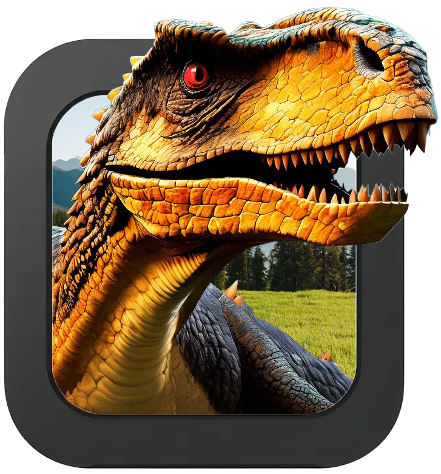
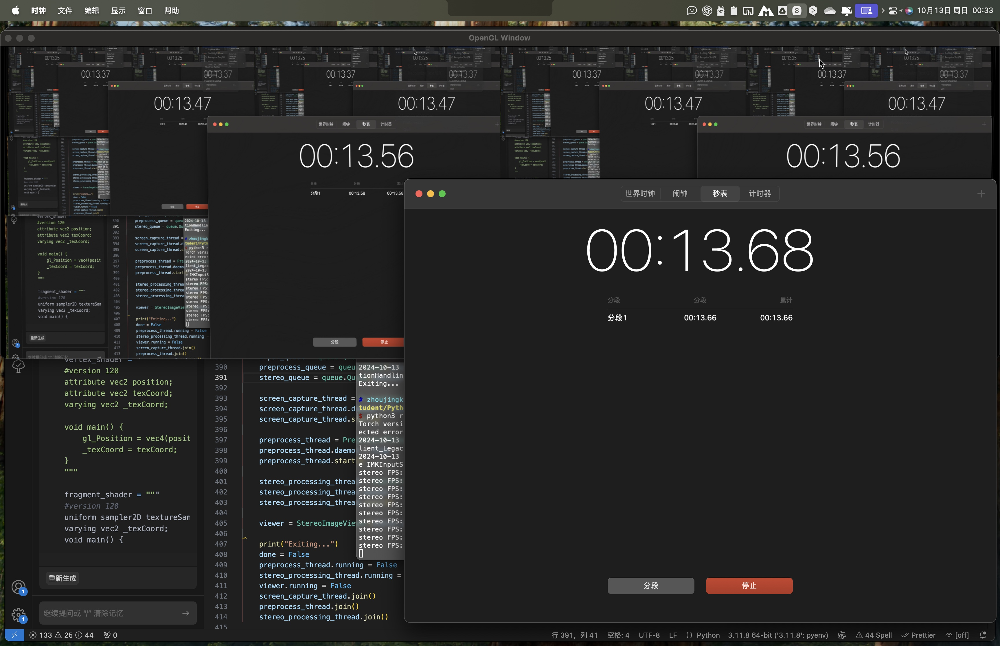

<div align="center">

<h1> Stereopsis Anything </h1>

[EN](../readme.md) | [中文](readme_cn.md)



</div>

**Stereopsis Anything** 可以实时将屏幕上的 2D 内容转换成立体图像（空间视频），理论上兼容多种 AR/VR 眼镜，如雷鸟 Air 1s/2s、X1、X2、Nreal Air 等。该项目专为 macOS 进行了优化，windows/linux系统可能运行效率较低。


## 特点
- 实时将屏幕上的 2D 内容转换成立体图像。
- 专为 macOS 优化。
- 使用 Pyobjc 调用 Screen Capture Kit 直接从 macOS 图像缓冲区获取屏幕截图。
- 特别优化的 CoreML Depth Anything V2 模型，支持 Tensor 输入/输出。
- 使用 OpenGL 在 GPU 上直接渲染图形。
- 在 M3 Max 上可以达到 33 FPS，延迟约为 100ms，适合流畅播放视频。
- 在 M2 上可以达到大约 15 FPS，略有卡顿，但又不是不能用 :satisfied:。


## 技术栈
- **Python**：用于开发和构建应用程序。
- **[Pyobjc](https://github.com/ronaldoussoren/pyobjc/tree/master)**：与 macOS 系统级功能交互。
- **[CoreML](https://github.com/apple/coremltools/tree/main)**：用于深度学习模型推理。
- **[OpenGL](https://pyopengl.sourceforge.net/)**：高效图形渲染。
- **[Screen CaptureKit](https://developer.apple.com/documentation/screencapturekit?language=objc)**：捕获屏幕内容。
- **[Pytorch](https://pytorch.ac.cn/)**：高性能 MPS 加速。
- **[mss](https://python-mss.readthedocs.io/index.html)**：屏幕截图。
  
## 安装指南
1. 克隆仓库到本地：
    ```bash
    git clone https://github.com/zjkhurry/stereopsis-anything.git
    cd stereopsis-anything
    ```
2. 安装依赖：
    ### MacOs
    ```bash
    pip3 install -r requirements.txt
    ```
    ### Windows/Linux
    ```bash
    pip3 install -r requirements_all.txt
    ```
    并且确保正确安装了 [CUDA Toolkit](https://developer.nvidia.com/cuda-toolkit) 和 [cuDNN](https://developer.nvidia.com/cudnn).

## 使用指南

### MacOS
运行主程序：
```bash
python3 run.py
```
程序将会裁剪主显示器中央16:9的区域 （由于Macbook的屏幕不是16:9，剪裁全屏 1080p 视频的显示区域），并创建一个窗口，显示立体视频（3840 x 1080）。将 AR 眼镜设置为 3D 模式，扩展屏幕，然后将立体视频窗口拖到扩展屏幕上进行全屏显示。按 'q' 键退出应用程序，使用 ',' 和 '.' 修改立体图像的深度。
对于M1，M2之类，性能没那么强的芯片，可以尝试使用NE来运行AI模型
```bash
python3 run.py -c "NE"
```
CPU的性能可能严重影响运行速度，可以尝试调低录屏的帧率来降低CPU的使用率，这里展示将速率将到15fps
```bash
python3 run.py -f 15
```
这些命令可以进行组合，例如：
```bash
python3 run.py -f 15 -c "NE"
```
### Windows/Linux
运行主程序：
```bash
python3 run_all.py
```
程序将会录制主显示器（windows上可能不会录制鼠标，需要等mss更新），并创建一个窗口，显示立体视频（3840 x 1080）。将 AR 眼镜设置为 3D 模式，扩展屏幕，然后将立体视频窗口拖到扩展屏幕上进行全屏显示。按 'q' 键退出应用程序，使用 ',' 和 '.' 修改立体图像的深度。

## Tips
- 确保 macOS 版本大于 macOS 13.0，并且 Mac 设备支持 OpenGL 2.1。
- 本代码仅在python 3.11上进行了测试，其他版本python可能会导致错误。
- 由于性能要求较高，建议使用支持的硬件设备（如 M3 Max 或 M2 Max 芯片）以获得最佳体验。
- 经测试，在M3 Max上使用GPU运行模型的速度远高于使用NE，但在M2上使用NE的速度远高于GPU，可自行尝试
- 如需进行个性化设置，例如修改录屏区域，修改coreml运行的设备（GPU，NE），修改输出画面的尺寸等，请使用
```bash
python3 run.py -h
```

---

<small> 注意：本项目使用 Apache License 2.0 许可证发布。商业用途需要事先获得作者的书面许可。请通过 zjkharry@gmail.com 联系作者获取更多信息。</small>